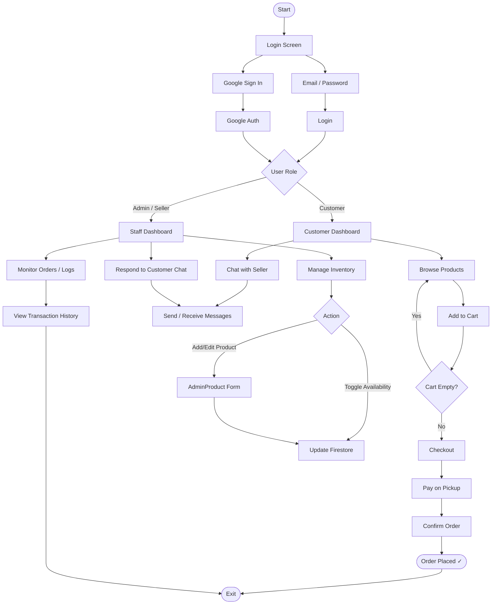

# SanZin K-Store — Navigation & Flow

```mermaid
flowchart TD
    A([Start]) --> B[Login Screen]

    B --> C[Email / Password]
    B --> D[Google Sign In]

    C --> E[Login]
    D --> F[Google Auth]

    E --> G{User Role}
    F --> G

    G -- Customer --> H[Customer Dashboard]
    G -- Admin / Seller --> I[Staff Dashboard]

    H --> J[Browse Products]
    J --> K[Add to Cart]
    K --> L{Cart Empty?}
    L -- No --> M[Checkout]
    L -- Yes --> J
    M --> N[Pay on Pickup]
    N --> O[Confirm Order]
    O --> P([Order Placed ✓])

    H --> Q[Chat with Seller]
    Q --> R[Send / Receive Messages]

    I --> S[Manage Inventory]
    S --> T{Action}
    T -- Add/Edit Product --> U[AdminProduct Form]
    T -- Toggle Availability --> V[Update Firestore]
    U --> V

    I --> W[Monitor Orders / Logs]
    W --> X[View Transaction History]

    I --> Y[Respond to Customer Chat]
    Y --> R

    P --> Z([Exit])
    X --> Z
```
